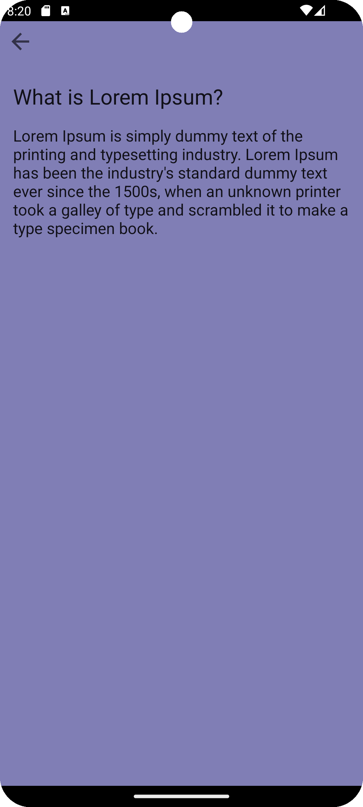
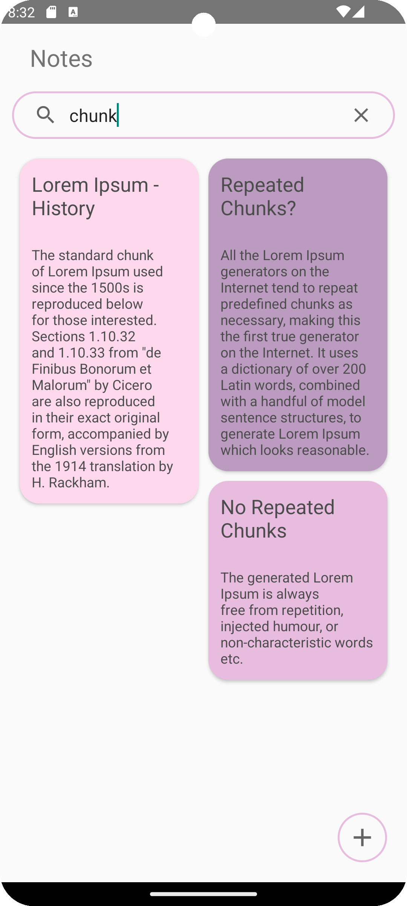

# Notes App

### Overview

The Notes App is a simple Android application that allows users to create, view, edit and delete their notes and find notes by searching for specific keywords.

## Features

- **Create Notes**: Users can create new notes by providing a title and content for the note.
- **Edit Notes**: Existing notes can be edited to update their title and content.
- **Delete Notes**: Users can delete individual notes they no longer need.
- **Search Notes**: The app provides a search functionality to filter notes based on title or content.
- **Persistent Storage**: Notes are stored locally on the device using the Room Database, ensuring data persistence even when the app is closed.

## Technologies Used

- **Android SDK**: The app is developed using Java/Kotlin programming language and the Android SDK.
- **Room Database**: Room is utilized as the database framework, offering an abstraction layer over SQLite. It provides an easy-to-use interface for database operations, including CRUD (Create, Read, Update, Delete) operations, and supports LiveData for observing database changes.
- **RecyclerView**: RecyclerView is used to display the list of notes efficiently. It dynamically loads and recycles views as the user scrolls through the list, improving performance and memory efficiency.
- **SearchView**: SearchView widget is integrated to implement search functionality, allowing users to quickly find notes based on their title or content.
- **Material Components**: Material Design components are used for UI elements, ensuring a modern and consistent look and feel across different Android devices.

## Usage

1. Launch the app on your Android device.
2. Tap on the "+" button to create a new note.
3. Enter a title and content for the note, then tap on the save button.
4. To edit an existing note, tap on the note in the list, make your changes, and the note gets updated.
5. To delete a note, long-press on the note in the list and confirm deletion.
6. Use the search bar to filter notes based on title or content.

### Screenshots
     

