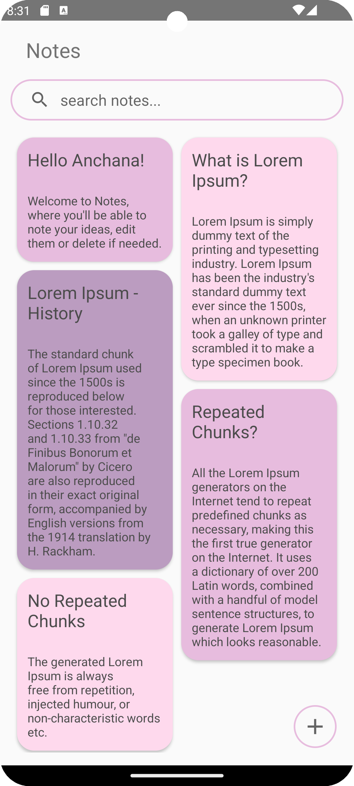

# Notes App

### Overview

The Notes App is a simple Android application that allows users to create, view their notes and find notes by searching for specific keywords.

### Features

1. **Create Notes**: Users can create new notes by typing their content into the app.
2. **View Notes**: Users can view the details of each note by clicking on the note in the list.
3. **Save Notes**: Notes are saved locally and persist even when the app is closed.
4. **Search Functionality**: Quickly find notes by searching for specific keywords.
5. **Simple User Interface**: The app provides a user-friendly interface for managing notes.

### Screenshots
   

### Usage

1. **Create a New Note**: Click on the "+" icon to create a new note. Enter the title and content of the note, then save it.
2. **View Note Details**: Click on a note in the list to view its details, including the title and content.
3. **Save Notes**: Notes are automatically saved when created or updated. They persist even if the app is closed or restarted.
4. **Search Functionality**: Quickly find notes by searching for specific keywords.

### Dependencies

The Notes App utilizes the following dependencies:

- RecyclerView: For displaying the list of notes.
- SharedPreferences: For storing and retrieving notes locally.

